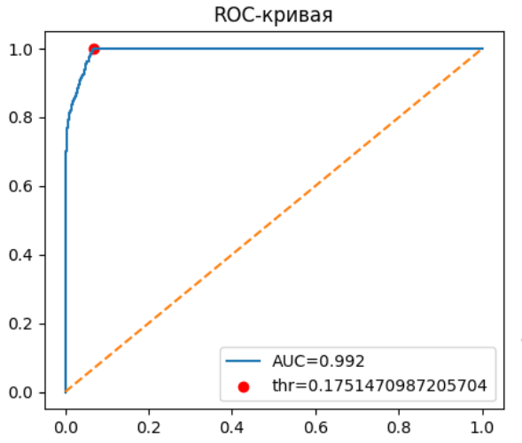

# Лабораторная работа №2. Аникин Арсений 6133-010402D.
## Задача машинного обучения

В лабораторной решается задача бинарной классификации: по данным о клиенте и параметрам кредита, предсказать, стотит ли выдавать кредит этому клиенту (будем считать вероятность того, что кредит впоследствии окажется в статусе 'overdue' или 'restruct'). 

## Тренировочные и тестовые данные

Признаки извлекаются из БД следующим SQL-запросом. Данные включают демографию клиента, данные о занятости и параметры кредитного продукта. Именно по этим параметрам рассчитывается вероятность проблем с кредитом в большинстве подобных задач.

```sql
SELECT
    il.id AS loan_uuid,
    EXTRACT(YEAR FROM age(c.birth_date)) AS client_age,
    ce.monthly_income,
    ROUND(EXTRACT(EPOCH FROM (CURRENT_DATE - ce.employment_start))/ 86400.0, 1) AS employment_days,
    il.interest_rate,
    il.amount,
    il.term_months,
    COALESCE(ps.n_paid, 0) AS n_paid,
    COALESCE(ps.paid_ratio, 0) AS paid_ratio,
    CASE WHEN il.status IN ('overdue', 'restruct') THEN 1 ELSE 0 END AS y_problem
FROM issued_loans      il
JOIN clients            c  ON c.id         = il.client_id
JOIN client_employment ce  ON ce.client_id = c.id
LEFT JOIN (
    SELECT
        issued_loan_id,
        COUNT(*) FILTER (
            WHERE payment_date IS NOT NULL AND actual_amount > 0
        ) AS n_paid,
        (COUNT(*) FILTER (
            WHERE payment_date IS NOT NULL AND actual_amount > 0
        ) / NULLIF(COUNT(*), 0)) AS paid_ratio
    FROM payments
) ps ON ps.issued_loan_id = il.id;
```

## Вектор признаков

Итоговый вектор признаков получился таким:

| Признак | Описание |
|---|---|
| `client_age` | Возраст клиента |
| `monthly_income` | Ежемесячный доход |
| `employment_days` | Стаж работы (дней) |
| `interest_rate` | Процентная ставка по кредиту |
| `amount` | Сумма кредита |
| `term_months` | Срок кредита (месяцев) |
| `n_paid` | Количество оплаченных платежей |
| `paid_ratio` | Доля оплаченных платежей |

## Разделение выборки

Данные делятся на обучающую - 80% и тестовую - 20% выборки со стратификацией по `y_problem`.

```python
from sklearn.model_selection import train_test_split

X_train, X_test, y_train, y_test = train_test_split(X, y, test_size=0.2, random_state=42, stratify=y)
```

## Классификатор и обучение

Выбран Random Forest. При обучении использовался параметр `class_weight='balanced'` для учёта дисбаланса классов. Метрикой для оценки качества классификации выступила ROC-AUC

```python
from sklearn.ensemble import RandomForestClassifier
from sklearn.metrics import classification_report, roc_auc_score

rf = RandomForestClassifier(
    n_estimators=100, random_state=42
)
rf.fit(X_train, y_train)

y_prob = rf.predict_proba(X_test)[:, 1]
y_pred = rf.predict(X_test)

print(classification_report(y_test, y_pred))
print("ROC-AUC:", roc_auc_score(y_test, y_prob))
```

## Оптимальные значения гиперпараметров

Подбор оптимальных гиперпараметров был произведён через `GridSearchCV`.

```python
from sklearn.model_selection import GridSearchCV, StratifiedKFold

grid = GridSearchCV(
    RandomForestClassifier(random_state=42),
    param_grid={
        "n_estimators":     [100, 200, 400, 600],
        "max_depth":        [None, 10, 15, 20],
        "min_samples_split":[2, 5, 10, 20],
    },
    cv=StratifiedKFold(5), scoring="roc_auc", n_jobs=-1
)
grid.fit(X_train, y_train)

best = grid.best_estimator_
print(grid.best_params_)
print("Best CV AUC:", grid.best_score_)
```

При такой конфигурации лучшими параметрами оказались: 
```json
{'max_depth': 10, 'min_samples_split': 20, 'n_estimators': 200}
Best CV AUC: 0.9910563663140983
```

## Важность признаков

Были оценены вклады признаков. Наибольший вклад дают `n_paid` - количество оплаченных платежей, `paid_ratio` - доля оплаченных платежен. Но стоит учитывать, что это актуально только для уже выданных кредитов. Если данных по кредиту нет, упадёт и точноть оценки.


## Оптимальный порог

Кроме прочего был оценён оптимальный порог, как максимум индекса Юдена. Он составил 0.19.

```python
from sklearn.metrics import roc_curve

y_prob = best.predict_proba(X_test)[:, 1]
fpr, tpr, thr = roc_curve(y_test, y_prob)
opt_thr = thr[np.argmax(tpr - fpr)]
print("Treshold:", opt_thr)
```

## Итоги обучения

```python
y_pred = (y_prob >= opt_thr).astype(int)
print(classification_report(y_test, y_pred))
print("ROC-AUC:", roc_auc_score(y_test, y_prob))
```

```
              precision    recall  f1-score   support

           0       1.00      0.93      0.97      1697
           1       0.73      1.00      0.84       303

    accuracy                           0.94      2000
   macro avg       0.86      0.97      0.90      2000
weighted avg       0.96      0.94      0.95      2000

ROC-AUC: 0.9922207895509646
```

Модель Random Forest достигает ROC-AUC около 0.992, что является отличным результатом, правда актуадьно только при наличии существующих платежей по кредитам.


