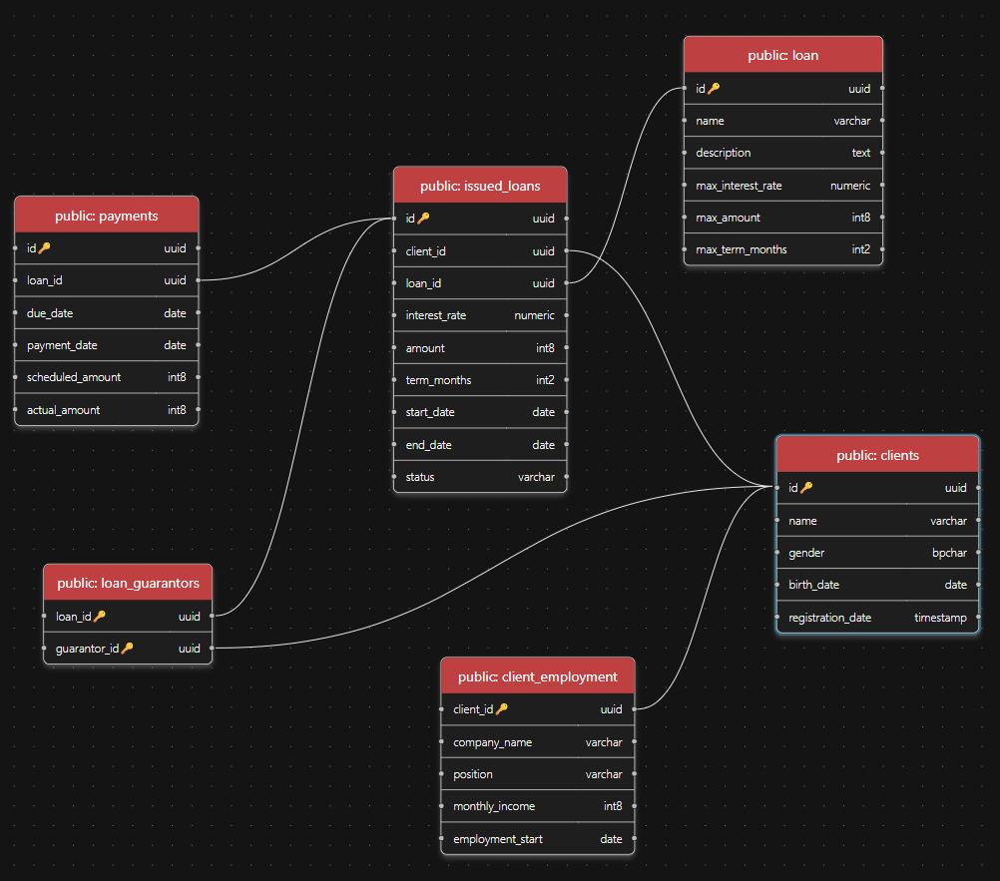

# Лабораторная работа №1. Аникин Арсений 6133-010402D.
## База данных кредитов

В качестве предметной области для лабораторной работы была взята область кредитования, в том числе для использования данных для решения задачи кредитного скоринга в ЛР №2.

## ER-модель



Кратко опишем сущности в БД и некоторые из полей.

| Таблица | Назначение | Основные поля |
|---|---|---|
| **loan** | Справочник кредитных продуктов банка | `id`, `name`, `max_interest_rate` - максимальная процентная ставка, `max_amount` - максимальная сумма по кредиту, `max_term_months` - максимальный срок кредита |
| **clients** | Клиенты банка | `id`, `name`, `gender`, `birth_date`, `registration_date` - дата регистрации в системе |
| **client_employment** | Место работы и доход клиента | `client_id`, `company_name`, `position` - должность клиента, `monthly_income` - ежемесячный доход, `employment_start` - дата трудоустройства |
| **issued_loans** | Выданные кредиты | `id`, `client_id`, `interest_rate`, `amount`, `term_months`, `start_date`, `end_date`, `status` - статус кредита (активен, закрыт, просрочен, реструктаризирован, восстановлен) |
| **payments** | История платежей по кредитам | `id`, `loan_id`, `due_date` - крайний срок оплаты, `payment_date` - дата оплаты, `scheduled_amount` - сумма к погажению в этот срок, `actual_amount` - реальный платёж |
| **loan_guarantors** | Поручители по кредитам | `loan_id`, `guarantor_id` | 

## Создание базы данных

В качестве примера приведём скрипт создания одной из таблиц *issued_loans*. Остальные можно увидеть в файле **create_tables.sql**

```sql
CREATE TABLE issued_loans(
    id UUID PRIMARY KEY,
    client_id UUID NOT NULL REFERENCES clients(id),
    loan_id UUID NOT NULL REFERENCES loan(id),
    interest_rate NUMERIC(5,2) NOT NULL CHECK (interest_rate >= 0),
    amount BIGINT CHECK (amount > 0),
    term_months SMALLINT NOT NULL CHECK (term_months > 0),
    start_date DATE NOT NULL,
    end_date DATE NOT NULL,
    status VARCHAR(20) NOT NULL CHECK (status IN ('active','closed','overdue','restruct', 'rehabilitated')),
    CONSTRAINT end_after_start CHECK (end_date > start_date)
);
```

Для некоторых значений указаны проверки значений, например для процентной ставки, суммы кредита и срока в месяцах - чтобы нельзя было указать их меньше 0. Также есть проверка статуса из ограниченого списка значений.

## Индексы

Были созданы различные индексы, например, индекс idx_issued_loans_status для ускорения поиска по статусам кредитов. Также были созданы уникальные индексы, например, udx_payments_loan_due_date, для защиты от ситуации в которой платёж по одному кредиту задвоится.

Создание остальных индексов - в файле **create_index.sql**

## Типовые запросы

В качестве вариантов типовых запросов были разработаны следующие запросы:
1. Все клиенты и их места работы
2. Статусы платежей по кредиту
3. Заёмщики и их поручители с информацией о кредите
4. Кредиты с просроченными платежами
5. Статистика выдачи кредитов по месяцам и продуктам
6. 100 клиентов с наибольшим суммарным долгом по продуктам'

Ниже приведён четвёртый запрос - кредиты с просроченными платежами - в качестве примера. В файле **select.sql** есть все запросы.

```sql
SELECT
    il.id AS loan_id,
    c.name AS client_name,
    l.name AS loan_product,
    il.amount,
    il.status,
    il.end_date,
    overdue.overdue_count,
    overdue.max_days_overdue,
    overdue.overdue_debt
FROM issued_loans il
JOIN clients c ON c.id = il.client_id
JOIN loan l ON l.id = il.loan_id
JOIN (SELECT
        p.issued_loan_id,
        COUNT(*) AS overdue_count,
        MAX(CURRENT_DATE - p.due_date) AS max_days_overdue,
        SUM(p.scheduled_amount) AS overdue_debt
    FROM payments p
    WHERE p.payment_date IS NULL
      AND p.due_date < CURRENT_DATE
    GROUP BY p.issued_loan_id)
    overdue ON overdue.issued_loan_id = il.id
ORDER BY overdue.max_days_overdue DESC;
```

В запросе используется объединение результатов по таблицам с подзапросом, в котором используются агрегатные функции для подсчёта количества просрочек, нахождения максимального количество дней задержки и подсчёта суммарого долга. Затем общий список кредитов с просрочками формируется по убыванию длительности просрочки.

## Генерация случайных данных

Данные генерируются с помощью одной процедуры fill_database. 

Создаётся 10 базовых типов кредитов с рандомными названиями, ставками (5–55%) и сроками, которые выбираются случайным образом из списка. 

Затем генерируется 1000000 клиентов. Для каждого выдаётся имя как случайная полседовательность букв, случайно определяется пол, вычисляется  случайный возраст (от 18 до 100 лет) и дата регистрации. 

```sql
    INSERT INTO clients(id, name, gender, birth_date, registration_date)
    SELECT
        gen_random_uuid(),
        substring(md5(i::text) from 1 for 15),
        CASE WHEN random() < 0.5 THEN 'M' ELSE 'F' END,
        CURRENT_DATE - (interval '18 years' + random() * interval '82 years'),
        NOW() - (random() * interval '5 years')
    FROM generate_series(1, count) AS i;
```

Аналогично генерируются данные о работе. 
Примерно 60% клиентов связываются с кредитами. И для каждого выданного кредита создаются ежемесячные платежи. 
С вероятностью 90% платеж помечается как оплаченный. 

Для 20% кредитов случайным образом назначается поручитель. 

В файле **fill_db.sql** представлена функция fill_database целиком.

## Работа запросов на больших объёмах данных

Проанализируем выполнение запросов на данных с помощью EXPLAIN ANALYZE. Результаты в таблице:

| Запрос | Время выполнения |
|---|---|
| 1) Все клиенты и их места работы | 1039 мс |
| 2) Статусы платежей по кредиту | 155 мс |
| 3) Заёмщики и их поручители с информацией о кредите | 185 мс |
| 4) Кредиты с просроченными платежами | 689 мс |
| 5) Статистика выдачи кредитов по месяцам и продуктам | 254 мс |
| 6) 100 клиентов с наибольшим суммарным долгом по продуктам | 356 мс |

Самым медленным запросом оказался первый - в нём происходит выборка из всех строк таблицы клиентов, а следовательно - полное последовательное считывание.
Также, достаточно медленным оказался запрос кредитов с просроченными платежами, так как в нём также происходит последовательный поиск и фильрация.
Остальные запросы показали неплохие результаты при тестируемом объёме данных, поэтому попытаемся оптимизировать лишь некоторые из них. 

## Изменение конфигурации, оптимизация

1. Начнём изменение с первого запроса, в нём запрашивается вся таблица клиентов целиком, поэтому добавлением индекса увеличить скорость выполнения запроса не получится. Можно сделать либо пагинацию данного запроса - в реальной системе, скорее всего, не нужно получать всех клиентов разом. Также можем получить ускорение за счёт увеличения параметра work_mem, определяющий объем оперативной памяти, выделяемый для каждой отдельной операции. Это нужно для того, хеш не сбрасывался на диск и на это не тратилось время.

2. Во втором запросе можно создать индекс для быстрой отработки подзапроса 
```sql
SELECT id FROM issued_loans ORDER BY start_date LIMIT 1
```
Кроме этого в конфигурацию добавим параметр условной стоимости чтения одной произвольной страницы с диска random_page_cost = 1.5, чтобы созданный индекс не был проигнорирован.

3. В третьем запросе, как и в первом, запрашивается таблица целиком. Попробуем ускорить его, просто добавив фильтрацию по статусу кредита. Например, добавим условие, чтобы в итоге получить информацию только по активным кредитам.
```sql
WHERE il.status = 'active'
```
Так как уже существует индекс по статусам выданных кредитов idx_issued_loans_status, фильтрация должна произойти быстро.

4. Для ускорения четвёртого запроса добавим индекс idx_payments_overdue для полей issued_loan_id, due_date, scheduled_amount, но только для платежей без даты оплаты. Добавим в конфигурацию параметры: parallel_setup_cost = 500 - знизим стоимость параллелизма, чтобы запрос исполнялся параллельно, а так же jit = off, чтобы части SQL-запросов не компилировались в машинный код. В данном запросе на jit-компиляцию уходит много времени.

Посе всех изменений запросы вновь были запущены. Получились следующие результаты:

| Запрос | Старое время выполнения | Новое время | Ускорение |
|---|---|---|---|
| 1) Все клиенты и их места работы | 1039 мс | 782 мс | 1.32 |
| 2) Статусы платежей по кредиту | 155 мс | 0.255 мс | 607 |
| 3) Заёмщики и их поручители с информацией о кредите | 185 мс | 81 мс | 2.28 |
| 4) Кредиты с просроченными платежами | 689 мс | 336 мс | 2.05 |

По итогу, можем видеть, что наилучшая оптимизация получилась во втором запросе, ускорение составило 607. Остальные запросы ускорились не так сильно, однако даже небольшое ускорение в высоконагруженных системах имеет большое значение. При многократном повтореним запросов, такая экономия суммируется в существенное снижение нагрузки на сервер и времени ответа для пользователей.